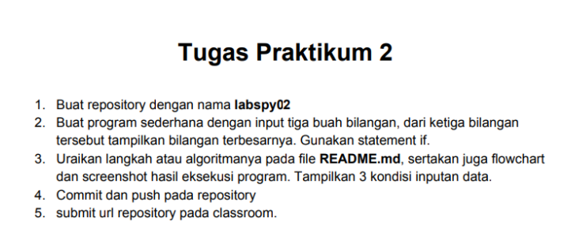
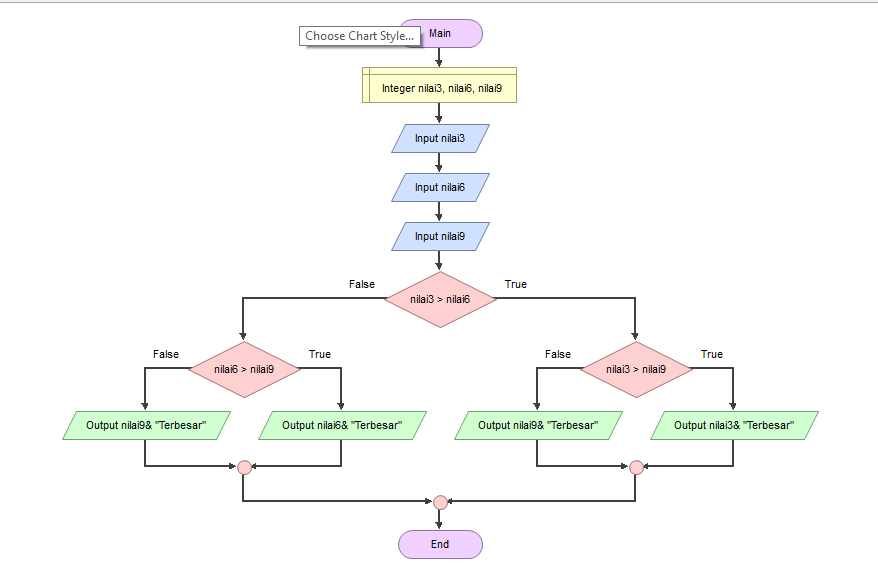
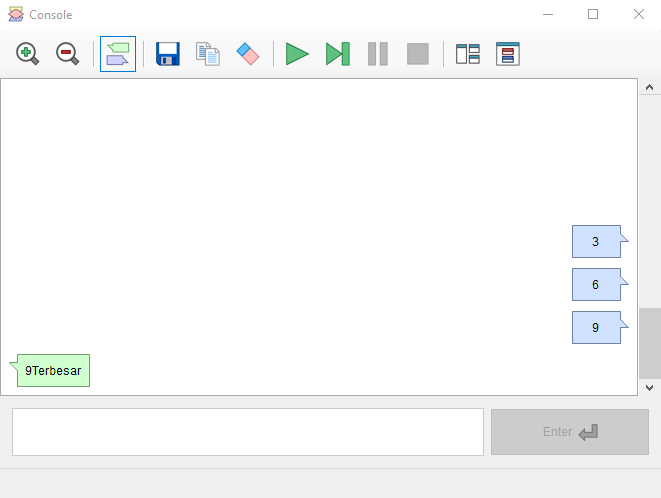

# Labspy02

**Nama  : Fery Affandi** <br>
**NIM   : 312010018** <br>
**Kelas : TI.20.A.1**

---------------------------------------------
Pada pertemuan 7 tugas PPT ke-2 ini, saya diberikan beberapa tugas yaitu : <br>



untuk mencari sebuah nilai maksimal dari 3 data yang sebelumnya telah diinput, dan setelah mendapat nilai maksimalnya, dirubah menjadi dalam sebuah bentuk flowchart

# TUGAS PRAKTIKUM 2

##### MENGINPUT DATA DAN MENCARI NILAI MAX
______________________________
Pertama-tama disini saya akan mencoba untuk menginput 3 data dengan menggunakan syntax berikut terlebih dahulu.
python
```python
a = int(input("Masukkan bilangan 1: "))
b = int(input("Masukkan bilangan 2: "))
c = int(input("Masukkan bilangan 3: "))
```
Masukan syntax tersebut dengan angka yang kalian inginkan. 

.png)

Jika sudah mendapat tampilan seperti gambar diatas, maka kalian sudah berhasil menginput ketiga data tersebut. <br>

Langkah selanjutnya adalah mencari tahu nilai terbesar (max) dari ketiga data tersebut. Sebelum memulainya kalian harus memasukan terlebih dahulu berapa jumlah data yang akan kalian kerjakan dari ketiga data tersebut dengan syntax <br>
python
```python
N=int(input("banyaknya data = "))
```

Karena disini saya diberi tugas mencari nilai max dari ketiga data maka saya akan menggunkan semua data diatas.

```python
if N>0:
    i=1
    x=int(input("data ke -"+str(i)+"="))
    max=x;total=x
    for i in range(2,N+1):
        x=int (input("data ke -"+str(i)+"="))
        total+=x
        if max<x:
            max=x

    print("bilangan terbesar =",max)
```
Selanjutnya kalian bisa langsung  memasukan syntax ini untuk melengkapi syntax diatas supaya bisa berjalan dengan baik seperti pada gambar dibawah ini.

.png)

Maka jika digabungkan, cara untuk mencari nilai max dari ketiga data yang diinputkan adalah dengan menggunakan syntax
python
N=int(input("banyaknya data = "))
if N>0:
    i=1
    x=int(input("data ke -"+str(i)+"="))
    max=x;total=x
    for i in range(2,N+1):
        x=int (input("data ke -"+str(i)+"="))
        total+=x
        if max<x:
            max=x

    print("bilangan terbesar =",max)

Seperti inilah hasil akhirnya 

.png)

##### MERUBAH DATA DIATAS MENJADI DALAM BENTUK FLOWCHART
____________________________
Setelah kalian mendapatkan semua data diatas langkah selanjutnya adalah mengubahnya menjadi dalam bentuk flowchart seperti ini



Untuk bisa mendapatkan hasil flowchart diatas, maka kalian harus mendownload flowgorithm terlebih dahulu. Download lah pada web resminya yaitu 
python
http://www.flowgorithm.org/download/index.htm

Download lah yang sesuai dengan laptop kalian agar tidak terjadi kendala saat sedang mengoperasikannya.


Setelah mendapat tampilan seperti dibawah ini kalian bisa mengklik pada bagian garis hitamnya


Pada tampilan diatas kalian dapat memilih menu mana yang kalian butuhkan.

Jika kalian sudah mengerjakannya hingga akhir, maka step akhir adalah kalian hanya perlu mengecek apakah flowchart tersebut sudah bekera dengan baik atau belum dengan cara sebagai berikut



Jika sudah me 'run' berkali kali dan mendapatkan jawaban sama yang sesuai itu berbarti flowchart yang kalian buat sudah benar dan bekerja dengan baik.